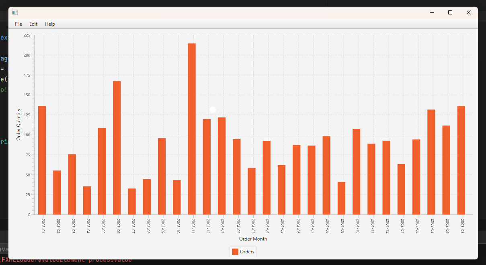
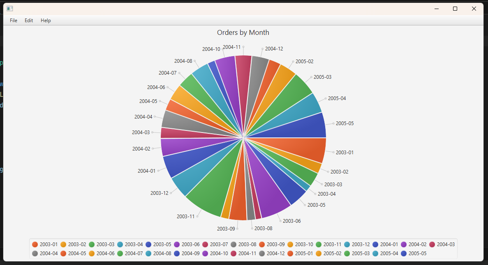
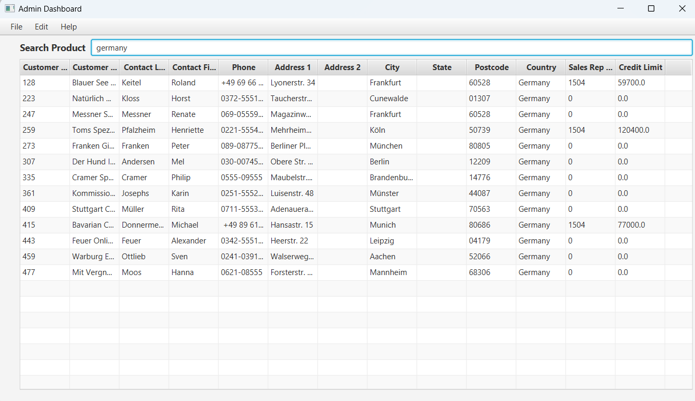

# Admin Dashboard Application (Under Development)

## Overview

This Java and JavaFX application serves as an admin dashboard for a company, providing insights into total sales for a month. The application allows administrators to visualize data through graphs, with the option to switch between bar graphs and pie charts. MySQL is used as the database to store and retrieve sales data, and Java JDBC is employed for database connectivity.

## Features

- Graphical representation of total sales data
- Option to switch between bar graphs and pie charts
- MySQL database integration for storing and retrieving data
- Java JDBC for seamless database connectivity
- Ability to search for customers and view their information along with their orders.

## Technologies used

- Java
- JavaFX
- MySQL Database Server

## Usage

- Launch the application and log in with your administrator credentials.
- Explore the dashboard to view total sales data in graphical format.
- Use the provided options to switch between bar graphs and pie charts.

## Contributers
`Adit Nuwal & Meer Modi`

